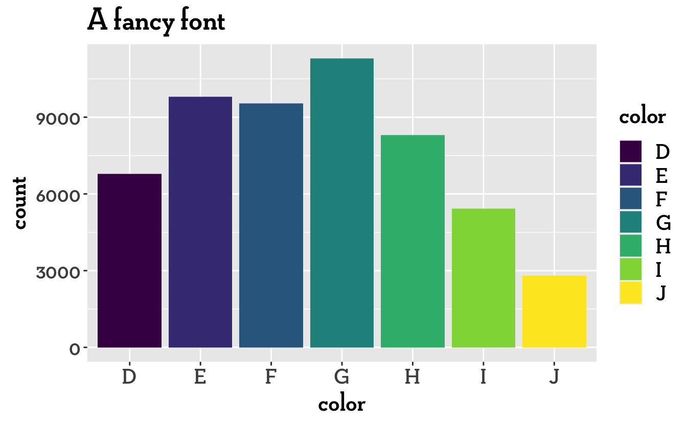
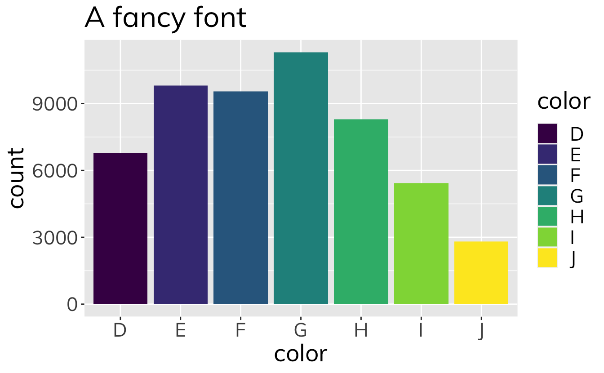

Testing using custom fonts with `ragg` and `systemfonts` (although don't seem to need to have either library loaded!)

<pre class='chroma'><code class='language-r' data-lang='r'><a href='https://rdrr.io/r/base/library.html'>library</a>(<a href='http://ggplot2.tidyverse.org'>ggplot2</a>)</code></pre>

### Using a font saved on my computer as .ttf

<pre class='chroma'><code class='language-r' data-lang='r'><a href='https://ggplot2.tidyverse.org/reference/ggplot.html'>ggplot</a>(diamonds) + 
  <a href='https://ggplot2.tidyverse.org/reference/geom_bar.html'>geom_bar</a>(<a href='https://ggplot2.tidyverse.org/reference/aes.html'>aes</a>(color, fill = color)) + 
  <a href='https://ggplot2.tidyverse.org/reference/labs.html'>ggtitle</a>("A fancy font") + 
  <a href='https://ggplot2.tidyverse.org/reference/theme.html'>theme</a>(text = <a href='https://ggplot2.tidyverse.org/reference/element.html'>element_text</a>(family = "Neutraface Slab Display TT Bold", size = 20))
</code></pre>

### Using a Google Font declared in `emk_font_set2`

<pre class='chroma'><code class='language-r' data-lang='r'><a href='https://ggplot2.tidyverse.org/reference/ggplot.html'>ggplot</a>(diamonds) + 
  <a href='https://ggplot2.tidyverse.org/reference/geom_bar.html'>geom_bar</a>(<a href='https://ggplot2.tidyverse.org/reference/aes.html'>aes</a>(color, fill = color)) + 
  <a href='https://ggplot2.tidyverse.org/reference/labs.html'>ggtitle</a>("A fancy font") + 
  <a href='https://ggplot2.tidyverse.org/reference/theme.html'>theme</a>(text = <a href='https://ggplot2.tidyverse.org/reference/element.html'>element_text</a>(family = "Raleway", size = 20))</code></pre>

### Using a Google Font saved in Font Book

<pre class='chroma'><code class='language-r' data-lang='r'><a href='https://ggplot2.tidyverse.org/reference/ggplot.html'>ggplot</a>(diamonds) + 
  <a href='https://ggplot2.tidyverse.org/reference/geom_bar.html'>geom_bar</a>(<a href='https://ggplot2.tidyverse.org/reference/aes.html'>aes</a>(color, fill = color)) + 
  <a href='https://ggplot2.tidyverse.org/reference/labs.html'>ggtitle</a>("A fancy font") + 
  <a href='https://ggplot2.tidyverse.org/reference/theme.html'>theme</a>(text = <a href='https://ggplot2.tidyverse.org/reference/element.html'>element_text</a>(family = "Mulish", size = 20))
</code></pre>

### Using a Google Font with `showtext`

### Using a .ttf font with `cairo`

<pre class='chroma'><code class='language-r' data-lang='r'>p &lt;- <a href='https://ggplot2.tidyverse.org/reference/ggplot.html'>ggplot</a>(diamonds) + 
  <a href='https://ggplot2.tidyverse.org/reference/geom_bar.html'>geom_bar</a>(<a href='https://ggplot2.tidyverse.org/reference/aes.html'>aes</a>(color, fill = color)) + 
  <a href='https://ggplot2.tidyverse.org/reference/labs.html'>ggtitle</a>("A fancy font") + 
  <a href='https://ggplot2.tidyverse.org/reference/theme.html'>theme</a>(text = <a href='https://ggplot2.tidyverse.org/reference/element.html'>element_text</a>(family = "Mulish", size = 20))

<a href='https://ggplot2.tidyverse.org/reference/ggsave.html'>ggsave</a>("Mulish-title.pdf", device = cairo_pdf)
#&gt; Saving 7 x 4.33 in image</code></pre>

### Using a .oft font with `cairo`

This also works

<pre class='chroma'><code class='language-r' data-lang='r'>p &lt;- <a href='https://ggplot2.tidyverse.org/reference/ggplot.html'>ggplot</a>(diamonds) + 
  <a href='https://ggplot2.tidyverse.org/reference/geom_bar.html'>geom_bar</a>(<a href='https://ggplot2.tidyverse.org/reference/aes.html'>aes</a>(color, fill = color)) + 
  <a href='https://ggplot2.tidyverse.org/reference/labs.html'>ggtitle</a>("A fancy font") + 
  <a href='https://ggplot2.tidyverse.org/reference/theme.html'>theme</a>(text = <a href='https://ggplot2.tidyverse.org/reference/element.html'>element_text</a>(family = "Museo", size = 20))

<a href='https://ggplot2.tidyverse.org/reference/ggsave.html'>ggsave</a>("Museo-title.pdf", device = cairo_pdf)
#&gt; Saving 7 x 4.33 in image</code></pre>

### Using a .otf with `ragg`

<pre class='chroma'><code class='language-r' data-lang='r'><a href='https://rdrr.io/r/grDevices/quartz.html'>quartz</a>()
<a href='https://ggplot2.tidyverse.org/reference/ggplot.html'>ggplot</a>(diamonds) + 
  <a href='https://ggplot2.tidyverse.org/reference/geom_bar.html'>geom_bar</a>(<a href='https://ggplot2.tidyverse.org/reference/aes.html'>aes</a>(color, fill = color)) + 
  <a href='https://ggplot2.tidyverse.org/reference/labs.html'>ggtitle</a>("A fancy font") + 
  <a href='https://ggplot2.tidyverse.org/reference/theme.html'>theme</a>(text = <a href='https://ggplot2.tidyverse.org/reference/element.html'>element_text</a>(family = "Museo", size = 20))</code></pre>

Also works

<pre class='chroma'><code class='language-r' data-lang='r'>p &lt;- <a href='https://ggplot2.tidyverse.org/reference/ggplot.html'>ggplot</a>(diamonds) + 
  <a href='https://ggplot2.tidyverse.org/reference/geom_bar.html'>geom_bar</a>(<a href='https://ggplot2.tidyverse.org/reference/aes.html'>aes</a>(color, fill = color)) + 
  <a href='https://ggplot2.tidyverse.org/reference/labs.html'>ggtitle</a>("A fancy font") + 
  <a href='https://ggplot2.tidyverse.org/reference/theme.html'>theme</a>(text = <a href='https://ggplot2.tidyverse.org/reference/element.html'>element_text</a>(family = "Museo", size = 20))

<a href='https://ggplot2.tidyverse.org/reference/ggsave.html'>ggsave</a>("Museo-title.png", type = "cairo")
#&gt; Saving 7 x 4.33 in image</code></pre>

### Using a computer .otf font with `showtext`

<pre class='chroma'><code class='language-r' data-lang='r'><a href='https://rdrr.io/r/base/library.html'>library</a>(<a href='https://github.com/yixuan/showtext'>showtext</a>)
#&gt; Loading required package: sysfonts
#&gt; Loading required package: showtextdb</code></pre>

Does not work:

<pre class='chroma'><code class='language-r' data-lang='r'><a href='https://rdrr.io/pkg/showtext/man/showtext_auto.html'>showtext_auto</a>()

<a href='https://ggplot2.tidyverse.org/reference/ggplot.html'>ggplot</a>(diamonds) + 
  <a href='https://ggplot2.tidyverse.org/reference/geom_bar.html'>geom_bar</a>(<a href='https://ggplot2.tidyverse.org/reference/aes.html'>aes</a>(color, fill = color)) + 
  <a href='https://ggplot2.tidyverse.org/reference/labs.html'>ggtitle</a>("A fancy font") + 
  <a href='https://ggplot2.tidyverse.org/reference/theme.html'>theme</a>(text = <a href='https://ggplot2.tidyverse.org/reference/element.html'>element_text</a>(family = "Museo", size = 20))</code></pre>

Not sure what counts as value for `regular`

<pre class='chroma'><code class='language-r' data-lang='r'>font_add("Museo", regular = "Museo")
<a href='https://rdrr.io/pkg/showtext/man/showtext_auto.html'>showtext_auto</a>()

<a href='https://ggplot2.tidyverse.org/reference/ggplot.html'>ggplot</a>(diamonds) + 
  <a href='https://ggplot2.tidyverse.org/reference/geom_bar.html'>geom_bar</a>(<a href='https://ggplot2.tidyverse.org/reference/aes.html'>aes</a>(color, fill = color)) + 
  <a href='https://ggplot2.tidyverse.org/reference/labs.html'>ggtitle</a>("A fancy font") + 
  <a href='https://ggplot2.tidyverse.org/reference/theme.html'>theme</a>(text = <a href='https://ggplot2.tidyverse.org/reference/element.html'>element_text</a>(family = "Museo", size = 20))</code></pre>

<pre class='chroma'><code class='language-r' data-lang='r'><a href='https://rdrr.io/r/base/library.html'>library</a>(<a href='https://dplyr.tidyverse.org'>dplyr</a>)
#&gt; 
#&gt; Attaching package: 'dplyr'
#&gt; The following objects are masked from 'package:stats':
#&gt; 
#&gt;     filter, lag
#&gt; The following objects are masked from 'package:base':
#&gt; 
#&gt;     intersect, setdiff, setequal, union
<a href='https://rdrr.io/r/base/library.html'>library</a>(<a href='http://stringr.tidyverse.org'>stringr</a>)
systemfonts::<a href='https://rdrr.io/pkg/systemfonts/man/system_fonts.html'>system_fonts</a>() %&gt;%
  <a href='https://dplyr.tidyverse.org/reference/filter.html'>filter</a>(<a href='https://stringr.tidyverse.org/reference/str_detect.html'>str_detect</a>(path, "Museo"))
#&gt; # A tibble: 3 x 9
#&gt;   path                 index name    family  style weight width italic monospace
#&gt;   &lt;chr&gt;                &lt;int&gt; &lt;chr&gt;   &lt;chr&gt;   &lt;chr&gt; &lt;ord&gt;  &lt;ord&gt; &lt;lgl&gt;  &lt;lgl&gt;    
#&gt; 1 /Users/ellakaye/Lib…     0 Museo-… Museo   500   normal norm… FALSE  FALSE    
#&gt; 2 /Users/ellakaye/Lib…     0 MuseoS… Museo … 500   normal norm… FALSE  FALSE    
#&gt; 3 /Users/ellakaye/Lib…     0 Museo-… Museo   300   light  norm… FALSE  FALSE</code></pre>

<pre class='chroma'><code class='language-r' data-lang='r'>font_add("Museo", regular = "/Users/ellakaye/Library/Fonts/exljbris - Museo-500")
<a href='https://rdrr.io/pkg/showtext/man/showtext_auto.html'>showtext_auto</a>()

<a href='https://ggplot2.tidyverse.org/reference/ggplot.html'>ggplot</a>(diamonds) + 
  <a href='https://ggplot2.tidyverse.org/reference/geom_bar.html'>geom_bar</a>(<a href='https://ggplot2.tidyverse.org/reference/aes.html'>aes</a>(color, fill = color)) + 
  <a href='https://ggplot2.tidyverse.org/reference/labs.html'>ggtitle</a>("A fancy font") + 
  <a href='https://ggplot2.tidyverse.org/reference/theme.html'>theme</a>(text = <a href='https://ggplot2.tidyverse.org/reference/element.html'>element_text</a>(family = "Museo", size = 20))</code></pre>

<pre class='chroma'><code class='language-r' data-lang='r'>font_add_google("Cinzel", "Cinzel")
<a href='https://rdrr.io/pkg/showtext/man/showtext_auto.html'>showtext_auto</a>()

<a href='https://ggplot2.tidyverse.org/reference/ggplot.html'>ggplot</a>(diamonds) + 
  <a href='https://ggplot2.tidyverse.org/reference/geom_bar.html'>geom_bar</a>(<a href='https://ggplot2.tidyverse.org/reference/aes.html'>aes</a>(color, fill = color)) + 
  <a href='https://ggplot2.tidyverse.org/reference/labs.html'>ggtitle</a>("A fancy font") + 
  <a href='https://ggplot2.tidyverse.org/reference/theme.html'>theme</a>(text = <a href='https://ggplot2.tidyverse.org/reference/element.html'>element_text</a>(family = "Cinzel", size = 20))</code></pre>

### From Andrew's blog

Need to have font family installed on computer

<pre class='chroma'><code class='language-r' data-lang='r'><a href='https://ggplot2.tidyverse.org/reference/ggplot.html'>ggplot</a>(mpg, <a href='https://ggplot2.tidyverse.org/reference/aes.html'>aes</a>(x = cyl, y = hwy)) +
  <a href='https://ggplot2.tidyverse.org/reference/geom_point.html'>geom_point</a>() +
  <a href='https://ggplot2.tidyverse.org/reference/geom_smooth.html'>geom_smooth</a>(method = "lm") +
  <a href='https://ggplot2.tidyverse.org/reference/annotate.html'>annotate</a>("text", x = 5, y = 35, label = "There aren't a lot of\n5 cylinder cars",
           family = "Source Sans Pro Semibold", color = "#DC5B44", size = 4) +
  <a href='https://ggplot2.tidyverse.org/reference/labs.html'>labs</a>(title = "Highway miles per gallon and cylinders",
       subtitle = "This is an interesting relationship, I guess",
       caption = "Source: ggplot's built-in data",
       x = "Cylinders", y = "Highway miles per gallon") +
  <a href='https://ggplot2.tidyverse.org/reference/ggtheme.html'>theme_light</a>(base_family = "Source Sans Pro") +
  <a href='https://ggplot2.tidyverse.org/reference/theme.html'>theme</a>(plot.caption = <a href='https://ggplot2.tidyverse.org/reference/element.html'>element_text</a>(family = "Source Sans Pro ExtraLight"))</code></pre>

{} Using theme fonts does NOT work. {} {} Also, using a .otf font in Font Book doesn't work. {} {} Also, using adding `face = "italic"` to `element_text` doesn't work if italic option not specified in font set. {} {} After adding a font to Font Book, might need to restart computer before it works in plots {}

